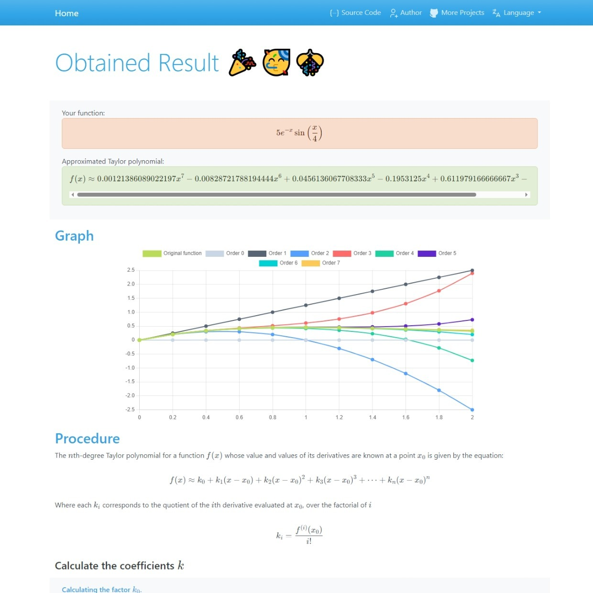

# Taylor Series Calculator

An interactive app to calculate idem using Django and SymPy.

live demo [right here.](https://taylor-series-calculator.up.railway.app/)

## Features

- Capable of calculating Taylor Series till 20 terms.
- Symbolic derivativation.
- Freindly step by step instructions and confortable interface.
- Display the graphical representation of the selected Series and lower order ones.
- Export the results in plain, latex and javascript formats.
- Display the error in case of wrong input.
- 4 Hours cache to reduce server load.
- Routes in English and Spanish, prepared for add another ones.

## Made with

Backend: 
- [Django](https://www.djangoproject.com/)
- [SymPy](https://www.sympy.org/)

Frontend (via cdn):
- [Bootstrap](https://getbootstrap.com/)
- [Alpine.js](https://alpinejs.dev/)
- [Chart.js](https://www.chartjs.org/)
- [KaTeX](https://katex.org/)

## Pending

- [ ] Add dynamic support for primary an new languages, at the moment html files are staticly written and must be updated one by one.

## Based on

- [Django tu primer sitio Web, Generador de Contraseñas](https://youtu.be/I0m92SBfDI8?si=tJS1g_-5IbDWmPCj)
- [Sube Proyectos de Django y Django REST Framework a Railway.app (Plataforma de la nube)](https://youtu.be/ZNnk81ifUTo?si=y0rcnrHjglVq2jjt)